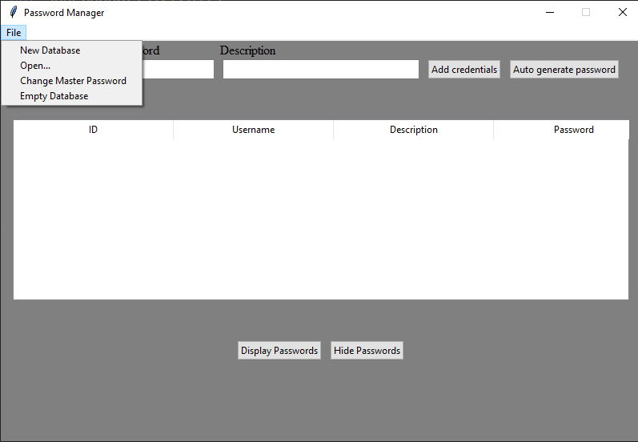

# PasswordManager_Python

A password manager in Python.
Once executed, you will have to either create a new database, or open an existing one.
Then you can modify the database by:

- Change master password
- Empty the database
- Add new credentials

You can also auto-generate a password with 15 characters. When saving the credentials, the password is being encrypted with a modified Ceasar encryption.

All credentials saved into the database will be displayed, all but the password. If you want to reveal the password, just mark the entry and press the button `Display Passwords`. Reverse, you can hide it again by pressing `Hide Passwords`.

